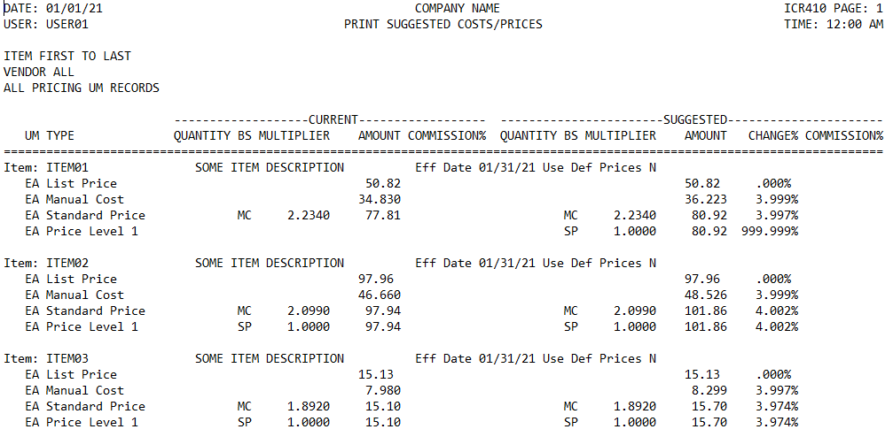

# extract-from-txt
## Extract relevant text from a large file, for analysis.

When prices or costs are updated in the ERP system, a text report (image below) is generated to preview the changes that will be implemented. Thousands of items can be updated in one batch upload, making it impractical to do a review of all changes. This program take the output of the "suggested price update" text file, extracts the relevant information, and puts it into an easily digestible excel file.

The program functions as a command line tool, which takes as an input the file directory of the text file to be parsed, and the desired ouptut directory and filename of the processed data.